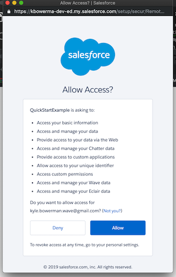

# Salesforce REST Api examples in JavaScript

## Purpose

The purpose of this document is to give examples of creating simple Javascript Apps that leverage Salesforce data.   There are several examples of this on the internet however, many are incomplete or have errors mostly due to dependency changes.  This document assumes the reader had moderate familiarity with Javascript but has limited exposure to Salesforce.

## Selecting a Library

The Salesforce API uses REST to interact with data, metadata and to handle authentication. An advance Javascript developer could build their own library to interface with the Salesforce API but that would be a great amount of effort when open source libraries are available.  This document will discuss two of the most popular JS libraries [JSforce](https://jsforce.github.io/) formerly known as Node-Salesforce by Shinichi Tomita and [ForceJS](https://github.com/ccoenraets/forcejs) by Chris Coenrates.  JSForce has a full suite of tools including a CLI and Web Console where as ForceJS describes itself as a micro-library that with a tiny footprint which is very easy to use.  In order to use these libraries we will also need a web server that can serve up the pages and OAuth callback URL defined in connected App.  In addition, this server will also act as a proxy server to avoid cross-domain policy issues when invoking Salesforce REST services.  Luckily both of these projects have companion servers.  ForceJS has [force-server](https://github.com/ccoenraets/force-server) and JSForce has [JSforce AJAX Proxy](https://github.com/jsforce/jsforce-ajax-proxy).  Both server projects are based on the popular Node web server [Express](https://expressjs.com/) and are available via NPM (Node Package Manger).  Since ForceJS / ForceServer automatically serves the OAuth callback URL we will start there.

## ForceJS / ForceServer

### Installing ForceServer

In order to run ForceServer it is best to install it globally with the *-g* flag.

     npm install -g force-server

### Example 1: Simple HTML file using forceJS served from ForceServer.

This is the quickest dirtiest way to see the REST API in action on your local machine.

##### Steps

1. Create a directory called example1 and cd to that directory
2. Create a connected app in your dev org with: **Enable OAuth Settings** and with the following Callback URL: ```http://localhost:8200/oauthcallback.html```
3. Get the ECMAScript5 version of the forcejs library [force.js here](http://ccoenraets.github.io/forcejs/force.js) and put it in your example1 directory.
4. Edit line 17  and change the *appId* value to the consumer key of the connected app you just create.  The demo will still work since the Default appId is valid.  You may need to change the login URL on line 12 if you are using a sandbox.
5. Create a file called index.html with the following:
```html
<html>
<body>
<ul id="list"></ul>
<script src="./force.js"></script>
<script>
force.login(function() {
    force.query('select id, Name from contact LIMIT 50', function (response) {
        var str = '';
        for (var i = 0; i < response.records.length; i++) {
            str += '<li>' + response.records[i].Name + '</li>';
        }
        document.getElementById('list').innerHTML = str;
    });
});
</script>
</body>
</html>
```
6. Run the server with:  ``` force-server --root . --debug```

You should see the following:

Once you click Allow you will see a list of 50 contacts
